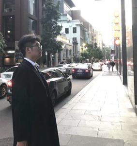

# About Me

My name is Xinchuan Fan, and I am a Final-year Electrical Engineering student at The University 
of Queensland. I excel at problem-solving and thrive in challenging situations, leveraging my 
ability to analyse problems from multiple perspectives to identify and implement the most 
effective solutions. I have a passion for applying my knowledge to real-world problem-solving, 
always eager to seize any opportunity for learning and growth. I’m graduating in mid-2023. 
Therefore, I am actively seeking a graduate program to further develop my skills in this sector 
and target to the grad position at the end of the program. 

Please feel free to contact me on [LinkedIn](www.linkedin.com/in/aaron-fan-635201215). :)

Mobile: (+61) 421591980

E-mail: xinchuan.fan@uqconnect.edu.au

www.linkedin.com/in/aaron-fan-635201215

